# Sahaya – Domestic Help Provider Application

Sahaya is a role-based Android application designed to help users quickly find and book domestic help services such as house help, plumbers, electricians, cooks, drivers, and ward helpers through a single, organized platform.

---

## 📌 Problem Statement

Finding reliable domestic help is often time-consuming and unorganized, especially during urgent situations such as electrical failures, plumbing issues, or the need for immediate ward assistance. Sahaya addresses this problem by providing a centralized platform where customers can easily discover service providers, place service requests, and track bookings efficiently.

---

## ✨ Key Features

- Role-based access for **Customer**, **Service Provider**, and **Admin**
- Easy service booking and request management
- Real-time booking status tracking
- Admin control over users, services, and bookings
- Secure authentication and authorization mechanisms

---

## 👥 User Roles & Application Flow

### Customer
- Register and log in
- Browse available services
- Book service providers
- Track booking status

### Service Provider
- Register and select up to two services
- Manage availability
- Accept or reject service requests
- View service history

### Admin
- Manage users and service providers
- Approve, monitor, or cancel bookings
- Handle overall system operations

---

## 🛠 Tech Stack

- **Android (Frontend):** Java, XML  
- **Backend:** Node.js, Express.js  
- **Database:** MySQL  
- **Tools & Platforms:** Android Studio, GitHub, Postman  

---

## 📸 Screenshots

> [Login Screen]
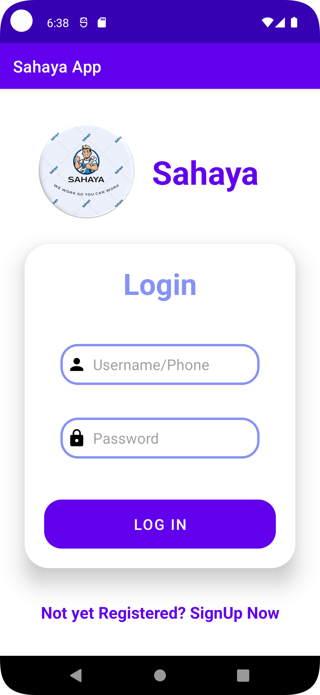

> [Signup Screen]
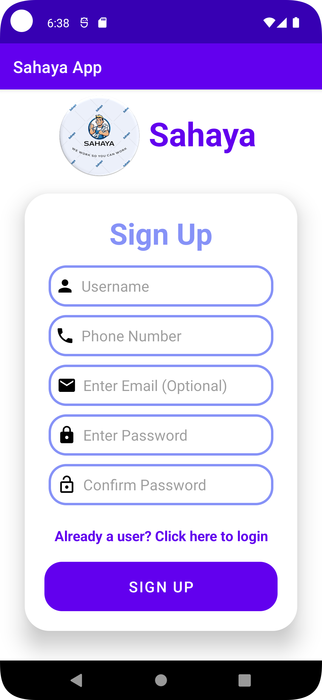

> [RoleSelection Screen]
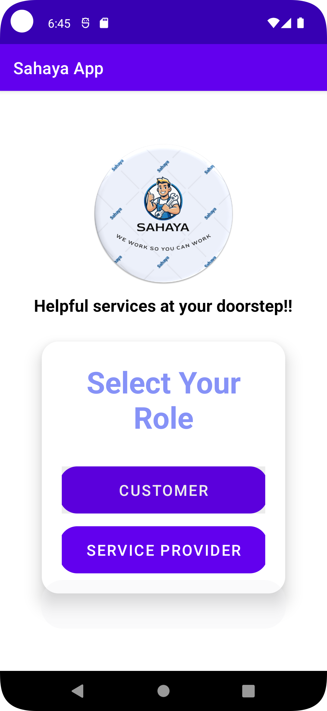

> [CustomerHome Screen]
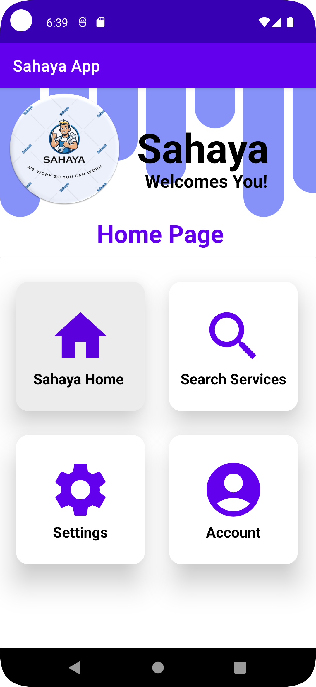

> [ProviderHome Screen]
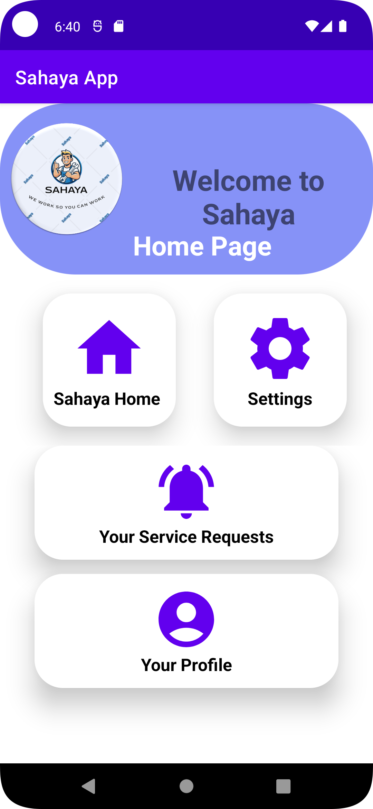

> [AdminHome Screen]
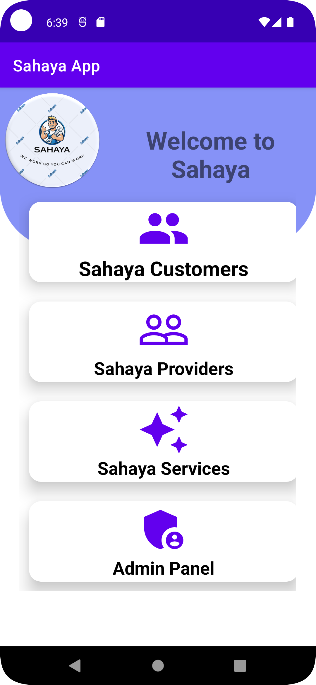

> [ServiceSelection Screen]
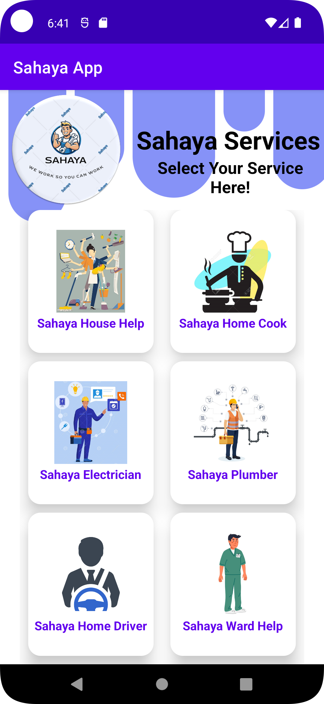

> [ServiceBook Screen]
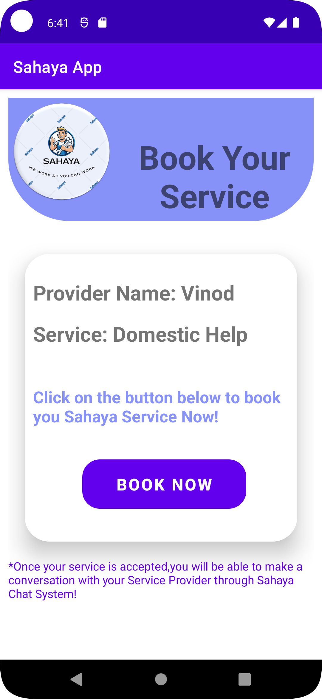

> [BookingConfirm Screen]
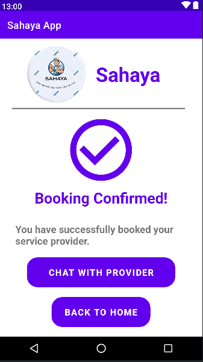

> [UserProfile Screen
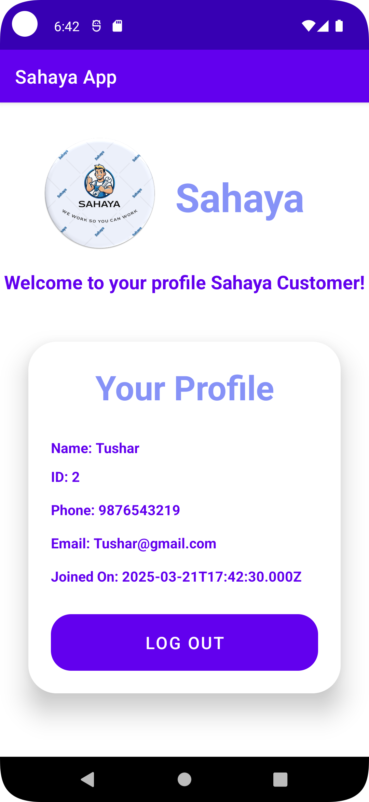

> [ProfileUpdate Screen]
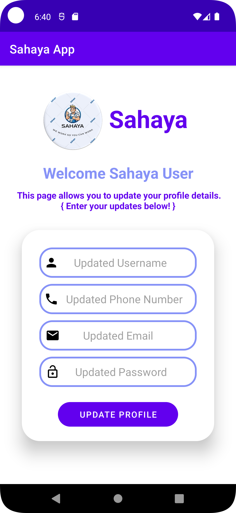

---

## 🎥 Demo Video

A working demo of the application can be viewed here:  
👉 [Click to watch demo](https://drive.google.com/file/d/1UZHeCSco_MtOphI9e_--q8_FZACIuBz9/view?usp=drive_link)

> Demo recorded during a stable build. Deployment and refactoring are currently in progress.

---

## 🚧 Project Status

This project was developed earlier and is currently under improvement. Certain modules are being refactored, and backend deployment is planned as part of future enhancements.

---

## 🔮 Future Enhancements

- Cloud deployment of backend services
- Improved UI/UX design
- Push notifications
- Rating and review system
- Live service tracking using maps
- In-app chat system
- Enhanced security and performance optimizations

---

## 🧠 What I Learned

- Designing and implementing role-based access control
- Integrating backend APIs with Android applications
- Managing relational databases using MySQL
- Structuring and organizing a real-world application project

